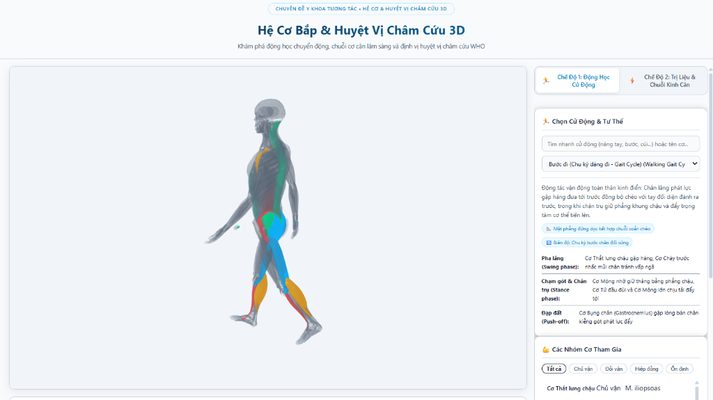

# Ứng Dụng 3D Hệ Cơ Bắp & Huyệt Vị Châm Cứu
### (3D Muscular System & Acupuncture Interactive Web Suite)

Ứng dụng web 3D tương tác chuyên sâu kết hợp giữa **Y học cổ truyền** (Học thuyết 12 Kinh Cân, Điểm Cân Kết & Tiêu chuẩn định vị huyệt WHO) và **Giải phẫu học — Cơ sinh học hiện đại** (Chuỗi cơ cân Myofascial Chains, Động lực học cử động & Phân vai cơ bắp).

<p align="center">
  <a href="https://hmh-215.github.io/Acupuncture/" target="_blank">
    
  </a>
  &nbsp;&nbsp;
  <a href="https://github.com/hmh-215/Acupuncture" target="_blank">
    
  </a>
</p>

<p align="center">
  
</p>

---

## 🌟 TÍNH NĂNG NỔI BẬT

### 1. Hai Chế Độ Tương Tác Y Khoa Độc Lập

- **🏃 Chế Độ 1: Động Học Cử Động (Kinematic Movement Analysis)**:
  - Mô phỏng các cử động giải phẫu và tư thế tượng động học (*Statue Poses*) chuẩn sinh lý: *Nâng tay qua đầu (Overhead Reach), Xoay người (Trunk Rotation), Dáng đi (Walking Gait), Cúi gập lưng (Forward Bending), Thế bắn cung Đạo dẫn (Archer Pull), Gập khuỷu tay...*
  - Tự động phân tích và highlight các nhóm cơ tham gia theo 4 vai trò y khoa chuẩn mực:
    - 🔴 **Chủ vận (Agonist)**: Phát lực chính sinh công.
    - 🔵 **Đối vận (Antagonist)**: Co ly tâm kiểm soát và hãm lực.
    - 🟠 **Hiệp đồng (Synergist)**: Trợ lực và hiệp đồng cử động.
    - 🟢 **Ổn định (Stabilizer)**: Khóa gốc chi và giữ vững trục khớp.
  - Các cơ không tham gia cử động được thể hiện bằng **Màu Xám Slate Trung Tính** đục 100% (*Opaque Solid*), giúp các nhóm cơ chủ vận và đối vận nổi bật rõ ràng, không bị chìm hay lẫn màu.

- **⚡ Chế Độ 2: Trị Liệu & Chuỗi Kinh Cân (Myofascial Pain & Acupuncture Chain)**:
  - Khảo sát các hội chứng cơ đau và điểm kích hoạt (*Trigger Points / Điểm Cân Kết*) phổ biến trên lâm sàng:
    1. *Hội chứng Cổ Vai Gáy (Co cứng Cơ Thang trên & Cơ Nâng vai)*.
    2. *Hội chứng Chóp Xoay & Viêm Gân Vai (Cơ Trên gai & Dưới gai)*.
    3. *Hội chứng Cơ Hình Lê & Đau Thần Kinh Tọa (Chèn ép dây thần kinh tọa)*.
    4. *Đau Thắt Lưng Cấp & Co Cứng Cơ Dựng Sống*.
    5. *Hội chứng Ống Cổ Tay & Co Cứng Gân Gập Cẳng Tay*.
    6. *Đau Mặt Trước Gối & Co Rút Cơ Tứ Đầu Đùi*.
  - Tự động nhận diện và highlight:
    - 🔴 **Vùng cơ đau đích / Trigger Point** (Màu đỏ Crimson cảnh báo).
    - 🟡 **Chuỗi cơ cân liên đới** theo đường truyền lực giải phẫu (*Myofascial Chains*) & Kinh Cân YHCT.
    - 🔵 **Cơ co rút đối ứng**: Phản ánh mất cân bằng đối kháng cơ.
  - **Hệ thống Điểm Huyệt 3D (Interactive 3D Acupoint Markers)**:
    - Hiển thị các điểm cầu phát sáng nhịp tim trực tiếp trên tọa độ 3D của cơ thể (*Kiên Tỉnh GB-21, Phong Trì GB-20, Thiên Tông SI-11, Hoàn Khiêu GB-30, Thận Du BL-23, Hợp Cốc LI-4, Ủy Trung BL-40, Túc Tam Lý ST-36...*).
    - Khi nhấp chọn huyệt vị, camera 3D tự động căn tiêu điểm trực diện vào huyệt.
    - Xem chi tiết: Mốc xương giải phẫu, Độ sâu châm an toàn (mm), Hướng đâm kim, Cảm giác Đắc Khí mong muốn và **Cảnh báo an toàn y khoa** (nguy cơ tràn khí màng phổi, chọc tạng, huyệt kỵ thai phụ).

---

### 2. Hai Hệ Thống Giải Phẫu Cốt Lõi

- 💪 **Hệ Cơ Thật (Muscular System)**: Dựng từ dữ liệu giải phẫu thực tế Z-Anatomy với hàng trăm thớ cơ riêng biệt. Thanh trượt Opacity điều chỉnh độ mờ linh hoạt từ 5% đến 100% (ở mức 100% mô hình hoàn toàn đục, người dùng có thể xoay 360° quan sát khối cơ chân thực; khi giảm độ mờ sẽ kích hoạt chế độ X-Ray thấu quang nhìn xuyên thấu vào các lớp cơ sâu).
- 🧠 **Hệ Thần Kinh (Nervous System)**: Toggle bật/tắt độc lập, hiển thị mạng lưới thần kinh tủy sống và ngoại biên màu vàng neon phát sáng, được căn chỉnh đồng bộ tọa độ chính xác tuyệt đối bên trong khoang cơ thể.

---

## 🚀 HƯỚNG DẪN CHẠY ỨNG DỤNG CỤC BỘ (LOCAL)

Do trình duyệt bảo mật chặn tính năng tải file mô hình 3D (`.fbx`) và dữ liệu (`.json`) qua giao thức `file://`, bạn có thể khởi chạy máy chủ cục bộ bằng **1 trong các cách đơn giản sau**:

### Cách 1: Nhấp đúp chuột (Tiện nhất trên Windows)
- Nhấp đúp chuột vào file **`start-server.bat`** tại thư mục gốc.
- Hệ thống sẽ tự động khởi tạo máy chủ HTTP và mở sẵn trình duyệt tại: `http://localhost:8080/`.

### Cách 2: Khởi chạy bằng PowerShell
```powershell
.\start-server.bat
# hoặc vào thư mục webapp:
cd 03-Interactive-Web\muscle-movement-3d
powershell -ExecutionPolicy Bypass -File .\run.ps1
```

### Cách 3: Sử dụng Python
```bash
cd 03-Interactive-Web/muscle-movement-3d
python -m http.server 8080
```
Sau đó mở trình duyệt truy cập: `http://localhost:8080/`

---

## 📜 TÀI LIỆU THAM KHẢO & NGUỒN DỮ LIỆU

Toàn bộ nội dung tri thức, phân vai vận động, chuỗi liên đới cơ và định vị huyệt vị trong ứng dụng được nghiên cứu, học tập và tổng hợp trực tiếp từ các nguồn tài liệu chính thống của dự án:

1. **Mô Hình 3D Giải Phẫu Minh Họa**:
   - **[Z-Anatomy](https://z-anatomy.com/)**: Mô hình giải phẫu người 3D mã nguồn mở (theo giấy phép Creative Commons Attribution-ShareAlike 4.0 International - CC BY-SA 4.0). Dữ liệu hình học được tối ưu hóa cho dựng hình WebGL thời gian thực trên Three.js.

2. **Tài Liệu Y Học Cổ Truyền & Cơ Sinh Học Châm Cứu Đạo Dẫn**:
   - **Độ Sinh Đường — Yếu Lược Châm Cứu Hệ Đạo Dẫn**: Ths. Bs Ngô Tiến Hưởng (`GOC-KINHDIEN_DoSinhDuong_YeuLuocChamCuuHeDaoDan_NgoTienHuong.pdf`). Nền tảng phân tích cơ sinh học vận động, chuỗi truyền lực đạo dẫn và phương pháp châm cứu chức năng phục hồi cân cơ.
   - **Học Thuyết 12 Kinh Cân Y Học Cổ Truyền**: Cầu nối khoa học giữa đường tuần hành của 12 Kinh Cân với giải phẫu các chuỗi cơ cân hiện đại (*Myofascial Chains*).

3. **Giáo Trình Giải Phẫu Học Hiện Đại**:
   - **Giáo Trình Giải Phẫu Người — Trường Đại Học Y Hà Nội**: Chủ biên PGS. TS. Nguyễn Văn Huy, Bộ môn Giải phẫu — ĐHYHN (`GOC-GIAOTRINH_Giai-Phau-Nguoi-Dai-Hoc-Y-Ha-Noi.pdf`, 516 trang). Cung cấp cơ sở khoa học chính xác về mốc xương định vị, nguyên ủy, bám tận, mạch máu và các nhánh thần kinh chi phối.
   - **Atlas Mô Học & Cơ Sinh Học Hệ Xương Khớp**: (`GOC-ATLAS_HeCoXuong_MoXuongKhop_Infographics.pdf`).

4. **Tiêu Chuẩn Định Vị Huyệt Vị Y Khoa Quốc Tế**:
   - **WHO Standard Acupuncture Point Locations in the Western Pacific Region**: Tổ chức Y tế Thế giới (WHO / WPRO). Chuẩn hóa mã định danh quốc tế (WHO Codes), mốc định vị giải phẫu sống, góc châm, độ sâu an toàn (mm) và các cảnh báo nguy cơ lâm sàng.
